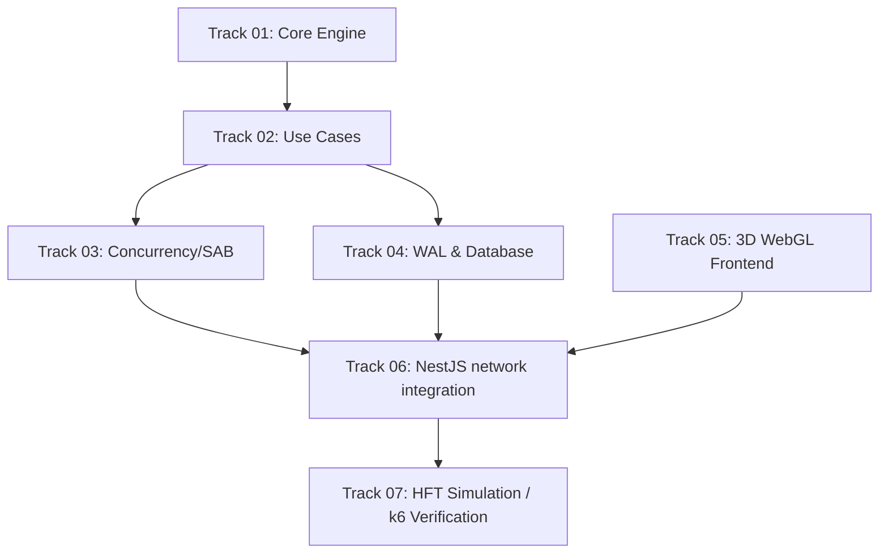

# Registro de Tracks de Desenvolvimento: ApexTrade

Este documento atua como o painel central de rastreamento de progresso do **ApexTrade**, listando o status de todas as tracks de desenvolvimento, prioridades e links para seus respectivos planos de ação e especificações.

---

## 1. Visão Geral das Tracks

| ID | Nome da Track | Status | Prioridade | Link do Plano |
| :--- | :--- | :--- | :--- | :--- |
| **01** | Domínio Puro & Algoritmo (Core Engine) | **[x] Concluído** | Alta | [01_core_engine/plan.md](file:///c:/projetos/ordem%20de%20pagamentos/conductor/tracks/01_core_engine/plan.md) |
| **02** | Regras da Aplicação & Portas (Use Cases) | **[x] Concluído** | Alta | [02_use_cases/plan.md](file:///c:/projetos/ordem%20de%20pagamentos/conductor/tracks/02_use_cases/plan.md) |
| **03** | Adaptadores & Concorrência (Multithread / SAB) | **[x] Concluído** | Alta | [03_concurrency/plan.md](file:///c:/projetos/ordem%20de%20pagamentos/conductor/tracks/03_concurrency/plan.md) |
| **04** | Durabilidade e WAL (Write-Ahead Log & DB) | **[ ] Planejado** | Alta | [04_durability/plan.md](file:///c:/projetos/ordem%20de%20pagamentos/conductor/tracks/04_durability/plan.md) |
| **05** | O Motor WebGL/WebGPU 3D (Next.js / R3F / Shaders) | **[ ] Planejado** | Média | [05_3d_frontend/plan.md](file:///c:/projetos/ordem%20de%20pagamentos/conductor/tracks/05_3d_frontend/plan.md) |
| **06** | Integração de Rede (NestJS WS & L2 Aggregator) | **[ ] Planejado** | Média | [06_network_integration/plan.md](file:///c:/projetos/ordem%20de%20pagamentos/conductor/tracks/06_network_integration/plan.md) |
| **07** | Simulação de Carga HFT & Validação de Métricas | **[ ] Planejado** | Média | [07_validation/plan.md](file:///c:/projetos/ordem%20de%20pagamentos/conductor/tracks/07_validation/plan.md) |

---

## 2. Legenda de Status
*   `[ ] Planejado`: A track está especificada e aguardando início de implementação.
*   `[/] Em Progresso`: A implementação e os testes da track estão sendo executados ativamente.
*   `[x] Concluído`: A track passou com sucesso por todas as etapas de verificação física, testes automatizados e code-review de performance.
*   `[~] Bloqueado`: A track possui impedimentos técnicos ou de dependência externa a serem resolvidos.

---

## 3. Dependências Arquiteturais entre Tracks

